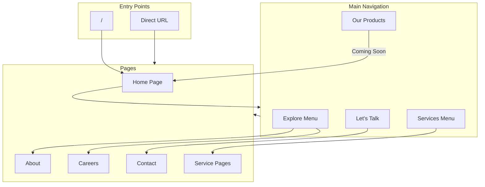

# CIUS Web App - Flow Tree

> Docs describe how navbar work 

## 📍 Page Routes

| Route      | Page     | Status    |
| ---------- | -------- | --------- |
| `/`        | HomePage | ✅ Active |
| `/about`   | About Us | ✅ Active |
| `/contact` | Contact  | ✅ Active |
| `/careers` | Careers  | ✅ Active |
| `/news`    | News     | ✅ Active |
| `/offer`   | Offer    | ✅ Active |
| `/product` | Product  | ✅ Active |
| `/report`  | Report   | ✅ Active |

---

## 🏗️ Root Layout Structure

```
app/layout.tsx
├── LenisProvider           # Smooth scrolling
│   └── ThemeProvider       # Dark/Light theme
│       ├── ScrollProgress  # Progress bar indicator
│       ├── Header          # Global navigation
│       ├── {children}      # Page content
│       └── Footer          # Global footer
```

---

## 🧭 Navigation Menu

### Services

| Section         | Items                                              |
| --------------- | -------------------------------------------------- |
| **Design**      | UI/UX, Brand Identity, Interaction                 |
| **Development** | Web & Mobile App, Backend Systems, Creative Coding |

### Our Products

| Item     | Status      |
| -------- | ----------- |
| Shop     | Coming soon |
| Showcase | Coming soon |

### Explore

| Item     | Route      |
| -------- | ---------- |
| About Us | `/about`   |
| Careers  | `/careers` |
| Journal  | `/journal` |

---

## 🏠 HomePage Sections

```
app/page.tsx
├── Hero              # Landing section với CTA
├── WhoWeAre          # Giới thiệu công ty
├── OurFocus          # Lĩnh vực tập trung
├── OurProducts       # Showcase sản phẩm
├── AISection         # AI capabilities
└── CTABand           # Call-to-action cuối trang
```

---

## 📦 Component Structure

```
components/
├── ui/                # Basic building blocks
│   ├── Button.tsx
│   ├── Card.tsx
│   ├── Input.tsx
│   ├── Badge.tsx
│   └── blur-reveal.tsx
│
├── layout/            # Structural components
│   ├── Header.tsx
│   ├── Footer.tsx
│   └── DropdownMenu.tsx
│
├── sections/          # Homepage sections
│   ├── Hero.tsx
│   ├── WhoWeAre.tsx
│   ├── OurFocus.tsx
│   ├── OurProducts.tsx
│   ├── AISection.tsx
│   └── CTABand.tsx
│
├── animations/        # Motion components
│
├── magicui/           # Special UI effects
│
├── common/            # Shared utilities
│   └── ScrollProgress.tsx
│
└── providers/         # Context providers
    ├── theme-provider.tsx
    └── lenis-provider.tsx
```

---

## 🎨 Design System Files

| File                    | Purpose                                 |
| ----------------------- | --------------------------------------- |
| `styles/globals.css`    | Theme tokens, CSS variables, animations |
| `styles/animations.css` | Additional animation keyframes          |

### Theme Tokens (globals.css)

- **Colors**: Primary (orange), Gray scale, Semantic (success, error, warning)
- **Typography**: PP Neue Montreal, Inter, Manrope, Instrument Serif
- **Spacing & Radius**: Tailwind v4 conventions
- **Animations**: fade-in, fade-up, shimmer, accordion, etc.

---

## 🔄 User Flow Diagram



---

## 📝 Notes for Redesign

### Keep

- [ ] Route structure
- [ ] Provider hierarchy (Lenis, Theme)
- [ ] Component naming conventions

### Can change

- [ ] Section order trong HomePage
- [ ] Navigation menu items
- [ ] Design tokens (colors, typography)
- [ ] Animation styles
- [ ] Component visual design

### New Create

- [ ] (Thêm những thứ cần tạo mới ở đây)

---

_Last update: 2026-01-10_
